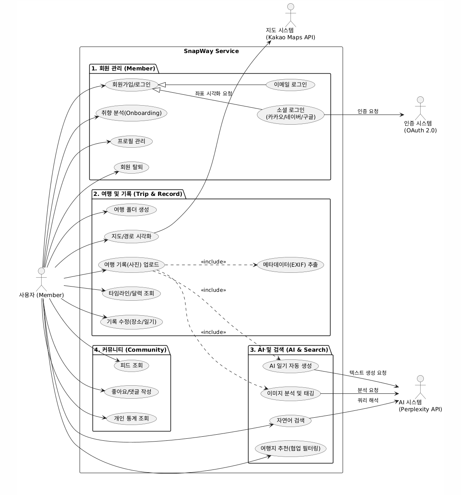
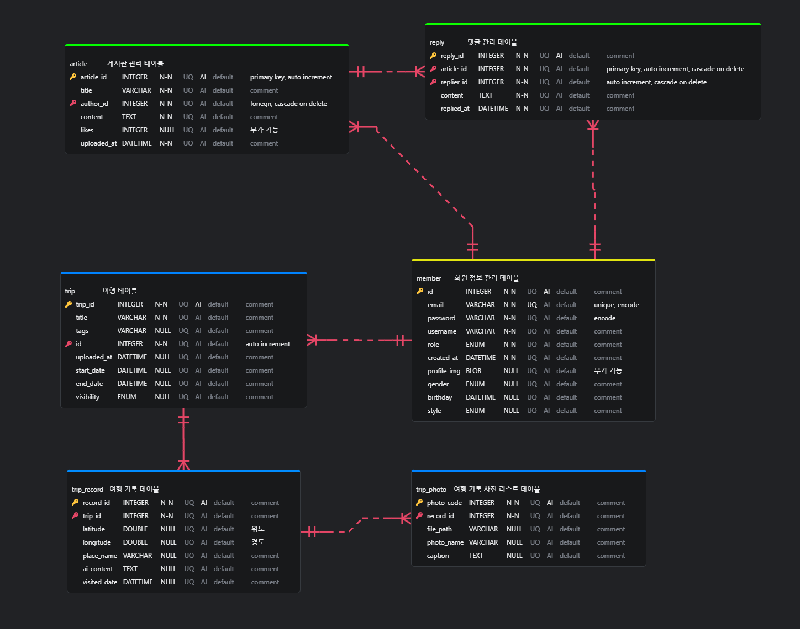

# 관통 프로젝트 : SnapWay

 

# 팀원
- 기장선
- 주요한
- 손홍민

# 12월 1주차 진행 현황

- Vue 프로젝트에 사용할 표준 디자인 선정
- HTML, CSS, JS로 진행했던 프론트 관통 프로젝트를 참조하여 현 프로젝트의 와이어 프레임을 구성하였음
- 주요한 : Spring Security, CORS 적용하여 Vue <-> SpringBoot 통신 코드 작성 및 점검
- 손홍민, 기장선 : 웹 디자인 구상 및 적용, Kakao Maps 및 공공데이터포털 API 적용, 추가 기능(게시판, 여행 기록 등) 페이지 UI 및 디자인 작성
- 향후 일정 : JWT 토큰의 적용 여부를 회의할 필요가 있음. 이후 각자 분배된 파트를 기반으로 백엔드 코드 완성 및 연동 테스트 요구됨.

 

## 0. 협업 규칙(Convention)

### 🌿 Git Branch Strategy

Git Flow 전략을 기반으로 운영합니다.

main: 배포 가능한 안정 버전 (Production)

develop: 개발 중인 버전 (Development)

feature/*_name: 기능 단위 개발 브랜치 (예: feature/login_KimSSAFY, feature/map-view_KimSSAFY)

### 💬 Commit Convention

[Type] Subject 형식을 따릅니다. (예: [Feat] 로그인 기능 구현)

Feat: 새로운 기능 추가

Fix: 버그 수정

Docs: 문서 수정 (README, Wiki, 주석 작성 등)

Style: 코드 포맷팅, 세미콜론 누락 등 (비즈니스 로직 변경 없음)

Refactor: 코드 리팩토링

Test: 테스트 코드 추가/수정

Chore: 빌드 업무 수정, 패키지 매니저 수정, 설정 변경

### 📢 PR (Pull Request) 규칙

Title: 커밋 메시지 컨벤션과 동일하게 작성합니다.

Description: 작업 내용, 변경 사항, 특이 사항(Breaking Change) 등을 간략히 기술합니다.

Review: 최소 1명 이상의 팀원 승인을 받은 후 develop 브랜치에 Merge합니다.

  

# 📸 SnapWay (스냅 웨이)

사진 기반 AI 여행 다이어리 서비스 > Your Journey, Documented Automatically.

 

## 1. 프로젝트 개요

프로젝트명: SnapWay (스냅 웨이)

주제: 사진 기반 AI 여행 다이어리 서비스

한 줄 소개: 사용자의 여행 사진을 AI가 분석하여 자동으로 기록하고, 개인 맞춤형 여행지를 추천하는 스마트 여행 다이어리

개발 기간: 2025년 11월 17일 ~ 12월 25일 (약 6주)

팀 구성: 3인 (역할 분담은 추후 상의)

 

## 2. 프로젝트 배경 및 필요성

🚩 문제 인식

정리의 어려움: 여행 후 수백 장의 사진이 갤러리에 방치되어 소중한 추억을 제대로 정리하지 못함.

감성 부재: 기존 여행 앱은 단순 장소 기록(POI) 중심이라 감성적인 추억 보관이 어려움.

추천의 한계: 여행 계획 시 사용자의 취향(자연, 도시, 액티비티 등)을 정밀하게 반영한 추천이 부족함.

💡 해결 방안

시각적 추억 보관: 텍스트보다 사진 중심의 기록으로 여행의 순간을 생생하게 저장.

자동화된 편의성: AI 자동 분석을 통해 번거로운 태깅과 정리 과정을 최소화.

개인화 추천: 사용자의 사진 데이터를 학습하여 취향을 저격하는 맞춤형 여행지 추천.

 

## 3. 프로젝트 목표 및 기대효과

🎯 핵심 목표

자동화: 사진 업로드만으로 위치, 날짜, 내용이 포함된 여행 기록 자동 생성.

개인화: AI 기반 취향 분석을 통한 만족도 높은 여행지 추천 서비스 구현.

기술 성장: Spring Boot, Vue.js, MySQL, AI API를 활용한 실전 풀스택 웹 개발 역량 강화.

📈 기대 효과

사용자: 여행 정리 시간 약 80% 절약, 감성적이고 체계적인 추억 아카이빙.

기술적: RESTful API 설계, 대용량 이미지 처리, AI 모델 연동, DB 최적화 경험 축적.

차별화: 기존 앱 대비 **사진 기반 자동화**와 **AI 개인화**라는 확실한 강점 확보.

 

## 4. 요구사항 분석

### 👤 회원 (Member)

회원가입/로그인: 일반 이메일 가입 및 소셜 로그인(Kakao/Google) 지원, JWT 기반 인증.

프로필 관리: 닉네임, 프로필 사진 변경, 비밀번호 수정.

여행 스타일 진단: 가입 시 선호하는 여행 스타일(자연, 도시, 휴양 등)을 선택하여 초기 추천 데이터 확보.

### 🗺 여행 기록 (Trip & Record)

여행 생성: 여행 제목, 기간, 공개 범위(PUBLIC/PRIVATE) 설정.

사진 업로드: 다중 이미지 업로드 지원, EXIF 메타데이터(위치, 시간) 자동 추출 및 파싱.

기록 시각화: 지도 위 마커(Pin) 표시, 방문 순서대로 타임라인 자동 정렬.

기록 편집: AI가 자동 생성한 내용(장소명, 일기 등)을 사용자가 수동으로 수정/삭제 가능.

### 🤖 AI 및 분석 (AI Analysis)

이미지 태깅: 사진 속 객체(음식, 풍경, 건물)를 인식하여 검색용 해시태그 자동 생성.

AI 일기 생성: 사진의 분위기, 시간, 장소 정보를 바탕으로 감성적인 짧은 일기 자동 작성.

취향 분석: 누적된 여행 데이터를 기반으로 사용자 선호도를 수치화하여 추천 알고리즘에 반영.

### 🔍 검색 및 추천 (Search & Recommendation)

자연어 검색: "작년 제주도에서 먹은 고기국수" 등 문장형 검색 쿼리 처리.

맞춤 추천: 사용자 취향 벡터와 유사한 여행지/코스를 협업 필터링 알고리즘으로 추천.

### Use - Case Diagram

 

## 5. 주요 기능

✅ 핵심 기능 (MVP)

### 1) 사진 기반 여행 기록 생성

사진 업로드 시 **EXIF 메타데이터**(위도, 경도, 시간)를 추출하여 지도에 핀(Marker) 자동 표시.

여행 경로를 타임라인 형태로 시각화하여 동선 파악 용이.

달력(Calendar) 뷰를 통해 날짜별 여행 기록 조회.

### 2) AI 이미지 태깅 및 스마트 검색

업로드된 사진을 AI가 분석하여 장소, 음식, 활동, 분위기 등의 태그 자동 생성.

자연어 검색(NLQ) 지원: "작년 여름 바다에서 먹은 음식 보여줘" 와 같은 질문형 검색 가능.

구현 기술: Perplexity API (또는 Google Vision API).

### 3) 사진 기반 개인 취향 분석 및 여행지 추천

사용자의 과거 여행 사진 패턴 분석 (예: 자연 40%, 도시 30%, 음식 20%, 액티비티 10%).

분석된 데이터를 바탕으로 협업 필터링(Collaborative Filtering) 알고리즘을 적용해 취향에 맞는 새 여행지 추천.

구현 기술: MySQL 데이터 축적 후 추천 알고리즘 적용.

### 4) AI 여행 경로 최적화

가고 싶은 장소들을 선택(Basket)하면 최적의 이동 동선 자동 생성.

이동 시간과 장소별 영업시간을 고려한 스마트 일정 추천.

구현 기술: Kakao Maps API + 경로 최적화 알고리즘.

➕ 부가 기능

### 5) 여행 다이어리 공유

여행 기록(Trip)의 공개/비공개(PUBLIC/PRIVATE) 설정.

SNS 스타일의 피드(Feed)를 통해 다른 사용자의 여행기 탐색 및 좋아요/댓글 소통.

### 6) 여행 통계 대시보드

올해 방문한 도시 수, 가장 많이 간 지역, 나의 여행 스타일(키워드) 분석 리포트 제공.

 

## 5. 기술 스택 및 시스템 아키텍처

🛠 개발 환경 및 도구

분류

기술 스택

Backend - Java, Spring Boot, MyBatis

Frontend - Vue.js, Axios, HTML/CSS (Responsive)

Database - MySQL 8.0

AI & API - Perplexity API (이미지/자연어), Kakao Maps API (지도/경로)

Infra - Local (차후 상황에 따라 서버를 구축할 예정)

협업 도구 - Notion (문서화), Git/GitLab (형상 관리)

🏗 시스템 아키텍처 (간단 구성도)

(이곳에 시스템 아키텍처 다이어그램을 삽입할 예정입니다)

💾 ERD (Entity Relationship Diagram)

