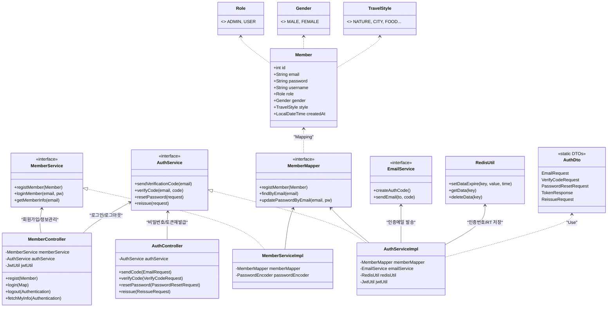
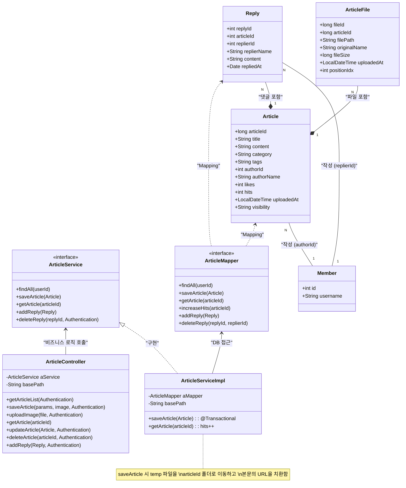
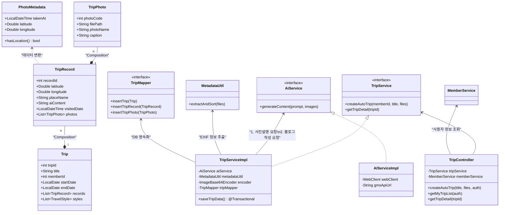

```mermaid
classDiagram
    direction BT

    %% 1. DTO & Enums
    class Member {
        +int id
        +String email
        +String password
        +String username
        +Role role
        +Gender gender
        +TravelStyle style
        +LocalDateTime createdAt
    }

    class AuthDto {
        <<static DTOs>>
        EmailRequest
        VerifyCodeRequest
        PasswordResetRequest
        TokenResponse
        ReissueRequest
    }

    class Role { <<Enumeration>> ADMIN, USER }
    class Gender { <<Enumeration>> MALE, FEMALE }
    class TravelStyle { <<Enumeration>> NATURE, CITY, FOOD... }

    Member ..> Role
    Member ..> Gender
    Member ..> TravelStyle

    %% 2. Controller Layer
    class MemberController {
        -MemberService memberService
        -AuthService authService
        -JwtUtil jwtUtil
        +regist(Member)
        +login(Map)
        +logout(Authentication)
        +fetchMyInfo(Authentication)
    }

    class AuthController {
        -AuthService authService
        +sendCode(EmailRequest)
        +verifyCode(VerifyCodeRequest)
        +resetPassword(PasswordResetRequest)
        +reissue(ReissueRequest)
    }

    %% 3. Service Layer
    class MemberService {
        <<interface>>
        +registMember(Member)
        +loginMember(email, pw)
        +getMemberInfo(email)
    }

    class MemberServiceImpl {
        -MemberMapper memberMapper
        -PasswordEncoder passwordEncoder
    }

    class AuthService {
        <<interface>>
        +sendVerificationCode(email)
        +verifyCode(email, code)
        +resetPassword(request)
        +reissue(request)
    }

    class AuthServiceImpl {
        -MemberMapper memberMapper
        -EmailService emailService
        -RedisUtil redisUtil
        -JwtUtil jwtUtil
    }

    class EmailService {
        <<interface>>
        +createAuthCode()
        +sendEmail(to, code)
    }

    %% 4. Persistence & Utils
    class MemberMapper {
        <<interface>>
        +registMember(Member)
        +findByEmail(email)
        +updatePasswordByEmail(email, pw)
    }

    class RedisUtil {
        +setDataExpire(key, value, time)
        +getData(key)
        +deleteData(key)
    }

    %% Relationships
    MemberController --> MemberService : "회원가입/정보관리"
    MemberController --> AuthService : "로그인/로그아웃"
    AuthController --> AuthService : "비밀번호/토큰재발급"

    MemberServiceImpl ..|> MemberService
    AuthServiceImpl ..|> AuthService
    
    MemberServiceImpl --> MemberMapper
    AuthServiceImpl --> MemberMapper
    AuthServiceImpl --> EmailService : "인증메일 발송"
    AuthServiceImpl --> RedisUtil : "인증번호/RT 저장"
    
    MemberMapper ..> Member : "Mapping"
    AuthServiceImpl ..> AuthDto : "Use"
```

```mermaid
classDiagram
    direction BT

    %% 1. DTO (Data Transfer Objects)
    class Article {
        +long articleId
        +String title
        +String content
        +String category
        +String tags
        +int authorId
        +String authorName
        +int likes
        +int hits
        +LocalDateTime uploadedAt
        +String visibility
    }

    class Reply {
        +int replyId
        +int articleId
        +int replierId
        +String replierName
        +String content
        +Date repliedAt
    }

    class ArticleFile {
        +long fileId
        +long articleId
        +String filePath
        +String originalName
        +long fileSize
        +LocalDateTime uploadedAt
        +int positionIdx
    }

    %% 2. Controller Layer
    class ArticleController {
        -ArticleService aService
        -String basePath
        +getArticleList(Authentication)
        +saveArticle(params, image, Authentication)
        +uploadImage(file, Authentication)
        +getArticle(articleId)
        +updateArticle(Article, Authentication)
        +deleteArticle(articleId, Authentication)
        +addReply(Reply, Authentication)
    }

    %% 3. Service Layer
    class ArticleService {
        <<interface>>
        +findAll(userId)
        +saveArticle(Article)
        +getArticle(articleId)
        +addReply(Reply)
        +deleteReply(replyId, Authentication)
    }

    class ArticleServiceImpl {
        -ArticleMapper aMapper
        -String basePath
        +saveArticle(Article) : @Transactional
        +getArticle(articleId) : hits++
    }

    %% 4. Persistence Layer
    class ArticleMapper {
        <<interface>>
        +findAll(userId)
        +saveArticle(Article)
        +getArticle(articleId)
        +increaseHits(articleId)
        +addReply(Reply)
        +deleteReply(replyId, replierId)
    }

    %% 5. Cross-Domain Relationship (Member 관련)
    class Member {
        +int id
        +String username
    }

    %% Relationships
    ArticleController --> ArticleService : "비즈니스 로직 호출"
    ArticleServiceImpl ..|> ArticleService : "구현"
    ArticleServiceImpl --> ArticleMapper : "DB 접근"
    
    ArticleMapper ..> Article : "Mapping"
    ArticleMapper ..> Reply : "Mapping"
    
    Article "1" *-- "N" Reply : "댓글 포함"
    Article "1" *-- "N" ArticleFile : "파일 포함"
    
    %% 회원 로직과의 연결점
    Member "1" -- "N" Article : "작성 (authorId)"
    Member "1" -- "N" Reply : "작성 (replierId)"

    note for ArticleServiceImpl "saveArticle 시 temp 파일을 \narticleId 폴더로 이동하고 \n본문의 URL을 치환함"
```

```mermaid
classDiagram
    direction BT

    %% 1. DTO & 도메인 모델
    class Trip {
        +int tripId
        +String title
        +int memberId
        +LocalDate startDate
        +LocalDate endDate
        +List~TripRecord~ records
        +List~TravelStyle~ styles
    }

    class TripRecord {
        +int recordId
        +Double latitude
        +Double longitude
        +String placeName
        +String aiContent
        +LocalDateTime visitedDate
        +List~TripPhoto~ photos
    }

    class TripPhoto {
        +int photoCode
        +String filePath
        +String photoName
        +String caption
    }

    class PhotoMetadata {
        +LocalDateTime takenAt
        +Double latitude
        +Double longitude
        +hasLocation() bool
    }

    %% 2. 컨트롤러 계층
    class TripController {
        -TripService tripService
        -MemberService memberService
        +createAutoTrip(title, files, auth)
        +getMyTripList(auth)
        +getTripDetail(tripId)
    }

    %% 3. 서비스 계층
    class TripService {
        <<interface>>
        +createAutoTrip(memberId, title, files)
        +getTripDetail(tripId)
    }

    class TripServiceImpl {
        -AiService aiService
        -MetadataUtil metadataUtil
        -ImageBase64Encoder encoder
        -TripMapper tripMapper
        +saveTripData() @Transactional
    }

    class AiService {
        <<interface>>
        +generateContent(prompt, images)
    }

    class AIServiceImpl {
        -WebClient webClient
        -String gmsApiUrl
    }

    %% 4. 매퍼 및 유틸리티
    class TripMapper {
        <<interface>>
        +insertTrip(Trip)
        +insertTripRecord(TripRecord)
        +insertTripPhoto(TripPhoto)
    }

    class MetadataUtil {
        +extractAndSort(files)
    }

    %% 관계 설정
    TripController --> TripService
    TripController --> MemberService : "사용자 정보 조회"
    
    TripServiceImpl ..|> TripService
    AIServiceImpl ..|> AiService
    
    TripServiceImpl --> AiService : "1. 사진설명 요청\n2. 블로그작성 요청"
    TripServiceImpl --> MetadataUtil : "EXIF 정보 추출"
    TripServiceImpl --> TripMapper : "DB 영속화"
    
    Trip "1" *-- "N" TripRecord : "Composition"
    TripRecord "1" *-- "N" TripPhoto : "Composition"
    
    TripRecord ..> PhotoMetadata : "데이터 변환"
```